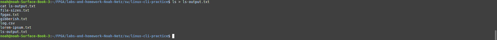

# Homework 7: Linux CLI Practice

## Problem 1: Count the number of words in `lorem-ipsum.txt`
```bash
wc -w lorem-ipsum.txt
```


---

## Problem 2: Count the number of characters in `lorem-ipsum.txt`
```bash
wc -m lorem-ipsum.txt
```


---

## Problem 3: Count the number of lines in `lorem-ipsum.txt`
```bash
wc -l lorem-ipsum.txt
```


---

## Problem 4: Numerically sort `file-sizes.txt` with unit multipliers
```bash
sort -h file-sizes.txt
```


---

## Problem 5: Numerically sort `file-sizes.txt` in reverse order
```bash
sort -rh file-sizes.txt
```


---

## Problem 6: Return the IP address column from `log.csv`
```bash
cut -d ',' -f 2 log.csv
```


---

## Problem 7: Return the timestamp and IP address columns from `log.csv`
```bash
cut -d ',' -f 1,2 log.csv
```


---

## Problem 8: Return the UUID and country columns from `log.csv`
```bash
cut -d ',' -f 3,4 log.csv
```


---

## Problem 9: Print the first 3 lines of `gibberish.txt`
```bash
head -n 3 gibberish.txt
```


---

## Problem 10: Print the last 2 lines of `gibberish.txt`
```bash
tail -n 2 gibberish.txt
```


---

## Problem 11: Print `log.csv` without the header
```bash
tail -n +2 log.csv
```


---

## Problem 12: Search for “and” in `gibberish.txt`
```bash
grep 'and' gibberish.txt
```


---

## Problem 13: Display occurrences of “we” with line numbers
```bash
grep -w -n 'we' gibberish.txt
```


---

## Problem 14: Print occurrences of “to <word>” on their own line
```bash
grep -oP '(?i)\bto \w+' gibberish.txt
```


---

## Problem 15: Count lines with "FPGAs" in `fpgas.txt`
```bash
grep -c 'FPGAs' fpgas.txt
```


---

## Problem 16: Print the rhyming lines in `fpgas.txt`
```bash
grep -E '(hot|not|cower|tower|smile|compile)' fpgas.txt
```


---

## Problem 17: Count comment lines in VHDL files
```bash
find ../../hdl/led-patterns -name '*.vhd' -exec sh -c 'echo -n "{}:"; grep -c "^--" "{}"' \;
```


---

## Problem 18: Redirect `ls` output to a file and display with `cat`
```bash
ls > ls-output.txt
cat ls-output.txt
```


---

## Problem 19: Search for “CPU” in `dmesg` output
```bash
sudo dmesg | grep 'CPU'
```


---

## Problem 20: Count VHDL files in the `hdl/` directory
```bash
find hdl/ -iname '*.vhd' | wc -l
```


---

## Problem 21: Count the total number of comment lines in `hdl/`
```bash
grep -r '^--' --include='*.vhd' ../../hdl/ | wc -l
```


---

## Problem 22: Print line numbers where "FPGAs" appear
```bash
grep -n 'FPGAs' fpgas.txt | cut -d ':' -f 1
```


---

## Problem 23: Find the 3 largest directories in the repository
```bash
du -h --max-depth=1 ../../ | sort -rh | head -n 3
```


---
