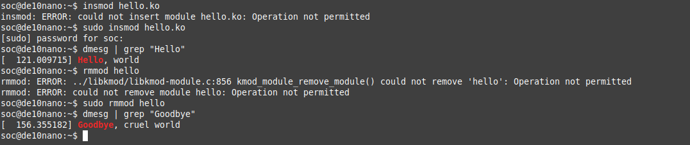
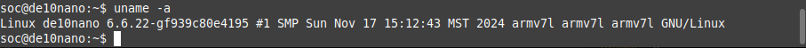
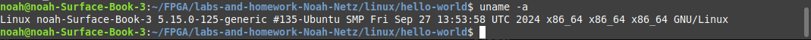
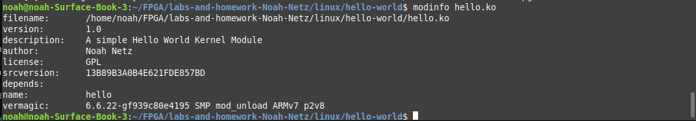

# Homework 8: Hello World Kernel Module

## Overview
Created and compiled a linux kernel that would say hello world and goodbye, cruel world.

## Deliverables
### Hello World and Goodbye, cruel world printed in the kernel's log buffer:

### Using uname in FPGA:

### Using uname in Linux:

### Using modinfo:

