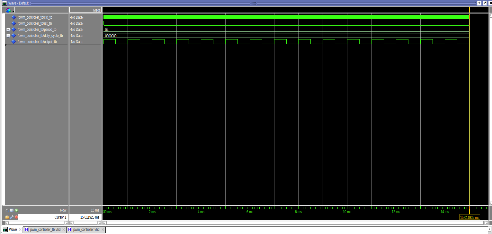
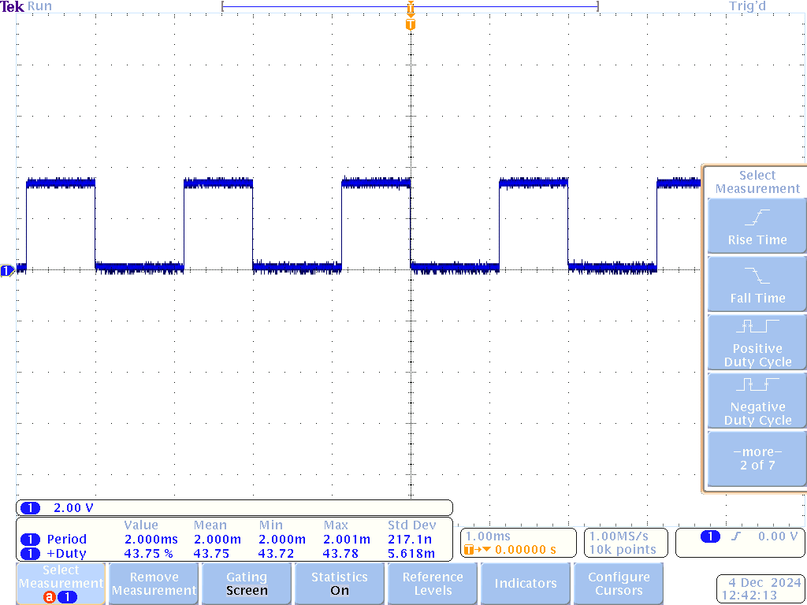

# Homework 9: PWM Controller

## Overview
In this homework, we were tasked with creating a pwm controller given a certain number of bits and fractional bits for our period and duty cycle. My period was 8.2 bits and my duty cycle was 25.24 bits.

## Deliverables

period of 2 ms and 50% duty cycle

