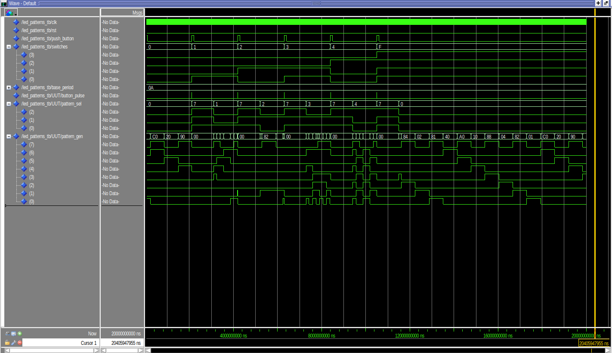

# Lab 4: LED Patterns

## Overview
In this lab, we created a custom hardware component called **LED_patterns** to generate LED light patterns on the DE10-Nano FPGA development board. The goal of the assignment was to design and implement an LED pattern generator entirely in VHDL, which included the design of several components such as the **Async Conditioner**, **State Machine**, and **LED Pattern Generator**. The project also involved creating a testbench to verify the functionality of the **LED_patterns** component.

The main objective was to explore hierarchical design in VHDL, ensuring that each submodule worked together seamlessly to produce desired LED patterns controlled by an FPGA-based state machine. We also learned how to condition external signals to be used effectively in a synchronous state machine.

## Deliverables

### Block Diagram

### State Machine Diagram

### Testbench Results
- **LED Patterns Testbench**:
  

- **Pattern Generator Testbench Results**:
  
  

## Lab Report

### 1. Project Overview

The **LED Patterns Project** focused on designing an FPGA component that generates LED patterns based on a state machine. The **functional requirements** of the project were:

- Implement an **Async Conditioner** to synchronize, debounce, and generate pulses for the push button input.
- Create a **state machine** with five states, each representing a different LED pattern.
- Design a **pattern generator** to implement each pattern.
- Control the state machine via the **push button** and **switches** on the DE10-Nano board.
- Ensure that **LED 7** blinks at a fixed rate for easy verification of the **base period**.

#### Functional Requirements
The **functional requirements** for the LED_patterns component were as described in the textbook:
- The **HPS_LED_control** signal must be set to `0` for this lab, meaning that the FPGA state machine controls the LED patterns.
- When the **push button** is pressed, the system displays the value of the **switches** on the LEDs for 1 second before transitioning to the next state.
- Five states, each corresponding to a different LED pattern:
  - **State 0**: Circular right shifting of one lit LED.
  - **State 1**: Circular left shifting of two side-by-side lit LEDs.
  - **State 2**: 7-bit up-counter running at twice the base rate.
  - **State 3**: 7-bit down-counter running at one-eighth the base rate.
  - **State 4**: Alternating pattern of LEDs

### 2. System Architecture

#### Block Diagram
The system architecture is shown in the block diagram below:

The **LED_patterns** component consists of three primary submodules:
1. **Async Conditioner**: This component synchronizes the **push button** signal with the system clock, debounces it, and generates a single pulse output. It helps ensure that the input is free of noise and can be used reliably by the **state machine**.
2. **LED Pattern State Machine**: The **state machine** is responsible for controlling the LED patterns based on the **push button** and **switches**. When the push button is pressed, the current state is saved, and the **switch value** is displayed for 1 second. Afterward, the system transitions to the next state.
3. **LED Pattern Generator**: This component generates specific LED patterns based on the **pattern selection signal** provided by the state machine. Different rates are used for each pattern, as determined by the **base period**.

The components work together to produce the desired LED outputs based on external inputs and internal state transitions.

#### LED Pattern State Machine
The **state machine** consists of five states, each corresponding to a different LED pattern. When the push button is pressed, the system transitions to **ShowSwitches** (`S5`), which displays the **switch value** on the LEDs for 1 second. The state machine transitions are depicted in the diagram below:

- **States**:
  - **State 0 (S0)**: One lit LED shifts right at a rate of **1/2 the base period**.
  - **State 1 (S1)**: Two lit LEDs shift left at a rate of **1/4 the base period**.
  - **State 2 (S2)**: 7-bit up-counter runs at a rate of **2 times the base period**.
  - **State 3 (S3)**: 7-bit down-counter runs at **1/8 the base period**.
  - **State 4 (S4)**: Custom user-defined pattern.

The **ShowSwitches** state (`S5`) is entered whenever the **push button** is pressed, displaying the **switch values** for **1 second** before transitioning to the appropriate state based on the switches.

### 3. Implementation Details

#### Custom User LED Pattern (State 4)
For **State 4 (S4)**, the custom user-defined pattern was implemented as an alternating LED pattern with a simple alternating sequence (`1010101`). This pattern was chosen because it provides a visually distinct output compared to the other states and is easy to identify during testing.

The **transition rate** for **State 4** was set to **1/4 the base period** to ensure the alternating effect was easily visible.

#### Additional Implementation Details
The implementation of the **Async Conditioner** was crucial for debouncing the **push button** and synchronizing the signal with the **FPGA clock**. It ensured reliable operation of the **state machine**, preventing false triggers caused by button noise.

The **testbench** for the **LED_patterns** component was created to verify the functionality of all modules and their integration. The results of the testbench can be seen in the images below:

- **LED Patterns Testbench**:  
  

- **Pattern Generator Testbench Results**:
    
  

The testbench verified that each state produced the expected output and that the state transitions occurred correctly in response to the **push button** and **switch inputs**.
